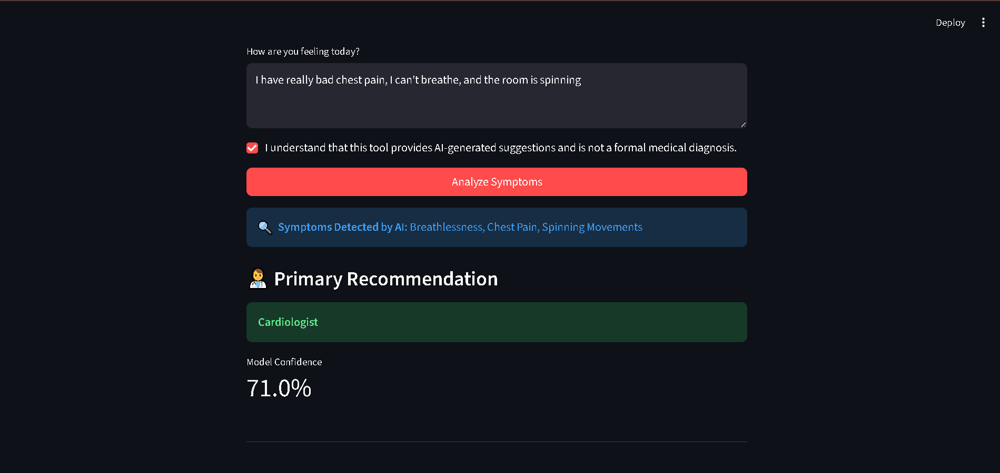

# MediRoute AI


MediRoute AI is an end-to-end machine learning web application designed to act as a smart medical triage assistant. 

Most symptom checkers force users to click through endless checkboxes. This project solves that by allowing patients to describe their symptoms naturally in plain English. A custom Natural Language Processing (NLP) engine parses the text, translates slang into medical terminology, and passes the formatted data into a Random Forest classifier to predict the most appropriate medical specialty.

*Disclaimer: This is a portfolio project and AI-powered triage tool. It does not replace professional medical advice or diagnosis.*

## Demo


## Model Performance
* **Training Accuracy:** 100.0%
* **Test Set Accuracy:** 100.0%
* **Dataset:** Kaggle Disease Prediction Dataset (4,920 rows, 132 features)

## Architecture: Train Local, Serve Container

To mirror real-world production systems, this project strictly separates model training from model serving.

1. **Model Training (Local):** A `RandomForestClassifier` is trained locally on a 4,920-row Kaggle dataset containing a 132-feature binary symptom matrix. The model is evaluated on a strict holdout test set to ensure high accuracy and serialized into a static `.pkl` artifact.
2. **NLP Feature Extraction:** When a user enters free text (e.g., "My tummy hurts and I'm throwing up"), the custom NLP engine maps patient slang and synonyms to the strict 132-feature matrix expected by the model.
3. **Model Serving (Docker):** The pre-trained model and NLP logic are baked into a lightweight, isolated Docker container (`python:3.12-slim`) dedicated solely to serving the Streamlit frontend.

## Project Structure

```text
mediRoute-ai/
├── app.py                  # Streamlit frontend serving application
├── docker-compose.yml      # Orchestration for the serving container
├── Dockerfile              # Container configuration (Pinned to Python 3.12)
├── requirements.txt        # Pinned Python dependencies
├── model/
│   ├── train.py            # Local ML training, evaluation, and serialization
│   ├── predict.py          # Inference logic, NLP extraction, and probability scoring
│   ├── model.pkl           # Serialized Random Forest model (Generated)
│   └── features.pkl        # Serialized feature column array (Generated)
└── data/
    ├── Training.csv        # Kaggle symptom dataset (Used for model fitting)
    └── Testing.csv         # Kaggle symptom dataset (Used for holdout evaluation)
```

## Local Setup & Deployment

### 1. Train the Model Locally
You must train the model on your host machine to generate the `.pkl` artifacts before building the Docker image.

Clone the repository and enter the directory:
```bash
git clone https://github.com/Dhruv-Patel-12/mediRoute-ai.git
cd mediRoute-ai
```

Create a virtual environment and install dependencies:
```bash
python -m venv venv
venv\Scripts\activate  # On macOS/Linux use: source venv/bin/activate
pip install -r requirements.txt
```

Execute the training script:
```bash
python model/train.py
```
*This outputs the model's accuracy on the unseen test set and successfully saves `model.pkl` and `features.pkl`.*

### 2. Serve the App with Docker
Once the model is trained, use Docker to serve the application in a clean, isolated environment. 

Build and start the container:
```bash
docker-compose up -d --build
```

Access the application in your browser at `http://localhost:8501`.

To stop the container when you are finished testing:
```bash
docker-compose down
```

## Testing the NLP Engine

Try pasting these highly realistic, unstructured patient scenarios into the web interface to test the NLP feature extraction and model routing:

* "I have really bad chest pain, I can't breathe, and the room is spinning." (Routes to Cardiology)
* "My face is breaking out with huge pimples and my skin is so itchy." (Routes to Dermatology)
* "I am constantly worried and nervous. Sometimes I start panicking out of nowhere." (Routes to Psychiatry)
* "I have a terrible tummy ache and I keep throwing up after I eat." (Routes to Gastroenterology)
* "I keep sneezing, I have a runny nose, and I am feeling really drained today." (Routes to ENT Specialist)

## Handling Data Bias
The Kaggle dataset used to train this model heavily biases toward physical diseases and lacks mental health data. To handle these edge cases without retraining on a completely new dataset, a custom "Psychiatry Override" is built into the NLP engine. If the system detects primary keywords like "sad", "crying", or "panicking", it safely routes the patient to a Psychiatrist rather than forcing an inaccurate physical diagnosis.

## License
This project is licensed under the MIT License.